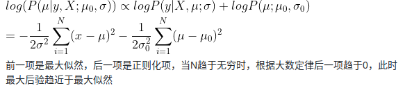
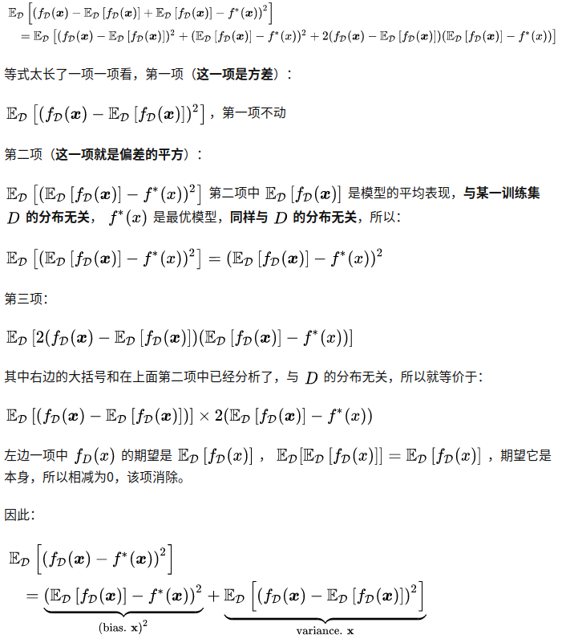

# 2-1

>  分析为什么平方损失函数不适用于分类问题

- 第一，使用平方损失函数意味着我们默认数据服从正态分布，用统计术语来说就意味着我们假设了高斯先验。但很显然，分类问题的数据并不服从正态分布，比如二分类问题则服从伯努利分布。

- 第二，MSE函数对于分类问题是非凸的。如果使用MSE进行模型训练，则不能保证将Loss函数最小化。

  

补充

[Why Using Mean Squared Error(MSE) Cost Function for Binary Classification is a Bad Idea?](https://towardsdatascience.com/why-using-mean-squared-error-mse-cost-function-for-binary-classification-is-a-bad-idea-933089e90df7)

# 2-2

> 在线性回归中，如果我们给每个样本$(x^{(n)},y^{(n)})$赋予一个权重$r^{(n)}$，经验风险函数为
> $$
> \mathcal{R}(\mathbf{w})=\frac {1}{2}\sum^{N}_{n=1}r^{(n)}\left(y^{(n)}-\mathbf{w}^\mathsf{T} \mathbf{x}^{(n)}\right)^2
> $$
> 计算其最优参数$w^*$，并分析权重$r^{(n)}$的作用

对经验风险函数求导，得到 $\frac{\partial {\mathcal R}(\mathbf w)}{\partial {\mathbf w}}$，另其等于0，即
$$
\begin{align}
\frac{\partial {\mathcal R}(\mathbf w)}{\partial {\mathbf w}}
&=\frac{1}{2} \sum_{n=1}^{N}r^{(n)} \frac{\partial \left \|\mathbf {y-X^\mathsf T w} \right \|^2}{\partial \mathbf w} \\
&= - \frac {1}{2} \sum_{n=1}^{N} r^{(n)}(y-\mathbf X^{\mathsf T}\mathbf w ) =0
\end{align}
$$
得到：$\mathbf w^* = \sum_{n=1}^{N}r^{(n)}(XX^ \mathsf T)^{-1}Xy$

# 2-3

> 证明在线性回归中，如果样本数量$N$小于特征数量$D+1$，则$\mathbf{XX^\mathsf{T}}$的秩最大为$N$

由矩阵秩的定理$rank(AB)\leq\min\{R(A),R(B)\}$，可得
$$
rank(\mathbf {XX^\mathsf T})\leq \min\{rank(\mathbf X),rank(\mathbf X^ \mathsf T)\}\\
又rank(\mathbf X)=rank(\mathbf X^\mathsf T) \leq \min\{N,D+1 \}\\
N < D+1\\
$$
 得$\mathbf {XX^\mathsf T}$的秩最大为N

# 2-4

>  在线性回归中，验证岭回归的解为结构风险最小化准则下的最小二乘估计，见公式2.44
> $$
> \mathcal R(w)=\frac{1}{2}||\mathbf y-X^\mathsf{T}||^2+\frac{1}{2}\lambda||w||^2
> $$

对结构风险最小化的目标函数进行求导，得到
$$
\frac{\partial {\mathcal R}(\mathbf w)}{\partial {\mathbf w}}=-\mathbf X(\mathbf y- \mathbf X^ \mathsf T \mathbf w)+\lambda \mathbf w \\
令上式等于0，得\\
-\mathbf X(\mathbf y- \mathbf X^ \mathsf T \mathbf w)+\lambda \mathbf w=0\\
则\mathbf{Xy = XX^\mathsf {T} w+\lambda w}\\
\mathbf{Xy = (XX^\mathsf {T} +\lambda I) w}\\
\mathbf {w = (XX^\mathsf {T} +\lambda I)^{-1}Xy}
$$
由此岭回归的解即为结构风险最小化准则下的最小二乘估计

# 2-5

> 在线性回归中，若假设标签$y\sim\mathcal {N}(\mathbf w^\mathsf{T} \mathbf x,\beta)$，并用最大似然估计来优化参数，验证最优参数为公式2.52的解

写出对数似然函数
$$
\begin{align}
\log p(\mathbf {y|X;w,\beta})&=\sum_{n=1}^N \log \mathcal N(y^{(n)};\mathbf w^\mathsf T \mathbf x^{(n)},\beta ^ 2) \\
&=\sum_{n=1}^N \log \left( \frac{1}{\sqrt{2 \pi}\beta}exp\left(-\frac{(y^{(n)}-\mathbf{w^ \mathsf T x})^2}{2\beta ^2} \right) \right)\\
&=\sum_{n=1}^N\log \frac{1}{\sqrt{2\pi}\beta}+\sum_{n=1}^{N}\log \left( exp\left(-\frac{(y^{(n)}-\mathbf{w^ \mathsf T x})^2}{2\beta ^2} \right) \right) \\

\end{align}
$$
将上式对$\mathbf w$求导，并令其等于0。其中，设对数底数为$e$，得
$$
\begin{align}
\frac{\partial p}{\partial \mathbf w} &= 0 - \frac{1}{2\beta ^2}\frac{\partial(\left\| \mathbf y - \mathbf X^\mathsf T \mathbf w \right\|^2)}{\partial \mathbf w} \\
&=-\frac{1}{2\beta^2}\mathbf X(\mathbf y-\mathbf{X^\mathsf T w})\\
&=0\\
得w^* &= (\mathbf {XX}^ \mathsf T)^{-1}\mathbf{Xy}
\end{align}
$$

# 2-6

>假设有$N$个样本$x^{(1)},x^{(2)},...,x^{(N)}$服从正态分布$\mathcal N(\mu ,\sigma^2)$，其中$\mu$未知。
>
>1. 使用最大似然估计来求解 最优参数$\mu ^ {ML}$
>2. 若参数$\mu$为随机变量，并服从正态分布$\mathcal N(\mu_0,\sigma_0^2)$，使用最大后验估计来求解最优参数$\mu^{MAP}$

1. 

   写出对数似然函数:
   $$
   \begin{align}
   \log p() &= \sum_{n=1}^N\log \mathcal N(x^{(n)};\mu,\sigma^2)\\
   &=\sum_{n=1}^N\log \frac{1}{\sqrt{2\pi}\sigma}+\sum_{n=1}^{N}\log \left( exp\left(-\frac{(x^{(n)}-\mu)^2}{2\sigma ^2} \right) \right) 
   \end{align}
   $$
   似然函数对$\mu$求导，令其等于0，得：
   $$
   \sum_{n=1}^N \frac{1}{\sigma^2}(x^{(n)}-\mu)=0\\
   \mu^{ML}= \frac{1}{N}\sum_{n=1}^N x^{(n)}
   $$

2. 

   由题有:
   $$
   p(\mu) = \frac{1}{\sqrt{2\pi}\sigma_0}exp(-\frac{(\mu-\mu_0)^2}{2\sigma^2_0})\\
   $$
   通过：
   $$
   \frac{\partial{\log \left(\prod_{n=1}^N p(X|\mu)p(\mu)\right)}}{\partial\mu}=0\\
   
   即 \sum_{n=1}^N \frac{1}{\sigma^2}(x^{(n)}-\mu)-\frac{1}{\sigma_0^2}(\mu-\mu_0 )=0
   $$
   得到最大后验概率估计：
   $$
   \mu^{MAP} = \frac{\mu_0+\frac{\sigma_0^2}{\sigma^2}\sum_{n=1}^Nx^{(n)}}{1+\frac{\sigma_0^2}{\sigma^2}N}
   $$
   

# 2-7

> 在习题2-6中，证明当$N \rightarrow \infin$时，最大后验估计趋向于最大似然估计

# 2-8

> 验证公式2.61

以回归问题为例，假设数据的真实分布为 $p_r(x,y)$ ，并采用**平方损失函数**，模型 $f(x)$期望风险为:

![[公式]](第2章.assets/equation-1602337822320.svg)

这里，我们把期望风险分解一下，**加入 ![[公式]](第2章.assets/equation-1602337844926.svg) ，即数据的真实条件分布**，即已知x时y的期望，那么：

![[公式]](第2章.assets/equation-1602337637908.svg)

这里省略了 ![[公式]](第2章.assets/equation.svg) ，同时将平方直接拆开了，这个等式里面：![[公式]](第2章.assets/equation-1602337637919.svg) 是不变的， $\mathcal E$ 也是不变的，只有 $f(x)$ 是要学习的模型，是可变的。**根据期望风险最小化原则，最小化  ![[公式]](第2章.assets/equation-1602338102284.svg)即获得最优模型 ，![[公式]](第2章.assets/equation-1602338119327.svg)**使上式中第二项第三项为0，即：

![[公式]](第2章.assets/equation-1602338130450.svg)

即**最优模型**为：

![[公式]](第2章.assets/equation-1602337637922.svg) 

引用自 [《神经网络与深度学习》笔记3 - 偏差方差分解](https://zhuanlan.zhihu.com/p/141166318)

# 2-9

> 试分析什么因素会导致模型出现图2.6所示的高偏差和高方差情况

高偏差原因：

1. 数据特征过少；

2. 模型复杂度太低；

3. 正则化系数λ太大；

高方差原因：

1. 数据样例过少；
2. 模型复杂度过高；
3. 正则化系数λ太小；
4. 没有使用交叉验证；

引用自：https://github.com/nndl/solutions/issues/16#issuecomment-691631783

# 2-10

> 验证公式2.66

引用自 [《神经网络与深度学习》笔记3 - 偏差方差分解](https://zhuanlan.zhihu.com/p/141166318)

# 2-11

> 分别用一元、二元和三元特征的词袋模型表示文本”我打了张三“和”张三打了我“，并分析不同模型的优缺点

一元： 

​	词表： 我 打 了 张 三

​	x1：   [1,1,1,1,1]

​	x2:      [1,1,1,1,1]

二元：

​	词表： $我  我打  打了 了张 张三 三# \$张 三打 了我 我#

​	x1: [1,1,1,1,1,1,0,0,0,0]

​	x2: [0,0,1,0,1,0,1,1,1,1] 

三元：

​	词表：$我打 我打了 打了张 了张三 张三# \$张三 张三打 三打了 打了我 了我#

​	x1: [1,1,1,1,1,0,0,0,0,0]

​	x2: [0,0,0,0,0,1,1,1,1,1]

一元特征的词袋模型词表的特征数量少，同样文本向量的特征数量也少，但是不同顺序的文本容易造成相同的BoW。二元、三元则反之。

# 2-12

> 对于一个三分类问题，数据集的真实标签和模型的预测标签如下：
>
> | 真实标签 | 1    | 1    | 2    | 2    | 2    | 3    | 3    | 3    | 3    |
> | -------- | ---- | ---- | ---- | ---- | ---- | ---- | ---- | ---- | ---- |
> | 预测标签 | 1    | 2    | 2    | 2    | 3    | 3    | 3    | 1    | 2    |
>
> 分别计算模型的精准率、召回率、F1值以及它们的宏平均和微平均

类别1

TP = 1  FN = 1  FP = 1  TN = 3

精准率：p = 1/2

召回率：R= 1/2

F1：1/2

类别2

TP = 2  FN = 1 FP = 2 TN = 5

精准率：1/2

召回率：2/3

F1:4/7

类别3

精准率：2/3

召回率：1/2

F1:4/7

宏平均

P=5/9

R=5/9

F1=5/9

微平均

平均精确率=平均召回率=5/9

F1=5/9

# 