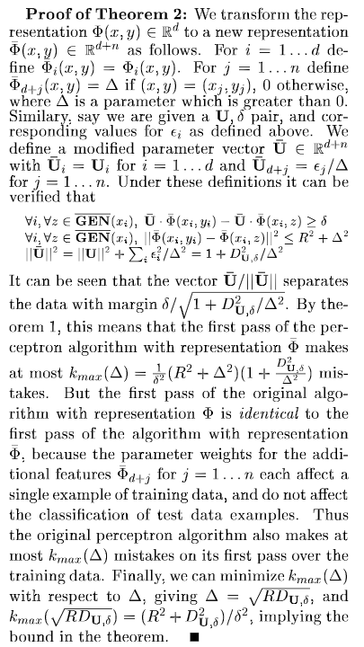

# 3-1

> 证明在两类线性分类中，权重向量$w$与决策平面正交

决策平面满足

​	$f(\mathbf x;\mathbf w)=\mathbf w ^\mathsf T \mathbf x + b =0$

如果$\mathbf x_1,\mathbf x_2$是决策超平面上的两个点，则下式有效：
$$
0 = \mathbf w ^\mathsf T \mathbf x_1 + b = \mathbf w ^\mathsf T \mathbf x_2 + b \Rightarrow \\
\mathbf w ^\mathsf T (\mathbf x_1 - \mathbf x_2) = 0
$$
由于向量的差值$\mathbf x_1 - \mathbf x_2$位于决策超平面上（对于任意的$\mathbf x_1 , \mathbf x_2$)，所以可以从上式看出权重向量$w$正交于决策平面

# 3-2

> 在线性空间中，证明一个点$x$到平面$f(\boldsymbol x;\boldsymbol w)=\boldsymbol w^\mathsf {T}\boldsymbol x+b=0$的距离为$\frac{\left |f(\boldsymbol x;\boldsymbol w)\right | }{ \left \| \boldsymbol w \right \| }$

设点$x$在平面$f(x;w)=0$上的投影为$x_1$,则$w^\mathsf T x_1 +b =0$

向量$\vec{xx_1}$与平面的法向量即权重向量$w$平行，则
$$
|w \cdot \vec{xx_1}| = |w||\vec{xx_1}| = \left \|w \right \|_2d \\
又 \\
\begin{align}
w \cdot \vec{xx_1} &= w^1(x^1-x^1_1)+w^2(x^2-x^2_1)+\dots+w^N(x^N-x^N_1)\\
&=w^1x+w^2x+\dots+w^Nx-(w^1x^1_1+w^2x^2_1+\dots+w^Nx^N_1)\\
&=w^1x+w^2x+\dots+w^Nx - (-b)\\
所以
\left \|w\right\|_2d &= |w^1x+w^2x+\dots+w^Nx +b| \\
&= |w\cdot x +b|\\

\end{align}\\
d = \frac{|f(x;w)}{\left \|w \right \|}
$$

# 3-3

> 在线性分类中，决策区域是凸的。即若点$x_1$和$x_2$被分为类别$c$，则点$\rho \boldsymbol x_1+(1-\rho)\boldsymbol x_2$也会被分为类别$c$，其中$\rho \in (0,1)$

基于“argmax"方式

记$w_c = w_c^\mathsf T，w_\bar{c} = w_\bar{c}^\mathsf T$

有
$$
w_cx_1 >w_\bar{c}x_1 \\
w_cx_2 >w_\bar{c}x_2 \\
$$
因为 $\rho \in (0,1)$,得 

$$
\rho w_cx_1 > \rho w_\bar{c}x_1 \\
(1-\rho)w_cx_2>(1-\rho)w_\bar{c}x_2 \\
$$
即
$$
\rho w_cx_1-\rho w_\bar{c}x_1>0 \\
(1-\rho)w_cx_2 -(1-\rho)w_\bar{c}x_2>0 \\
$$
两式相加，得
$$
\rho w_cx_1-\rho w_\bar{c}x_1 +(1-\rho)w_cx_2 -(1-\rho)w_\bar{c}x_2>0 \\
$$
即
$$
w_c(\rho x_1+(1-\rho)x_2) > w_\bar{c}(x_1+(1-\rho)x_2)
$$
所以点$\rho \boldsymbol x_1+(1-\rho)\boldsymbol x_2$ 也会被分为类别c

# 3-4

> 给定一个多分类的数据集，证明：
>
> 1. 如果数据集中每个类的样本都和除该分类之外的样本是线性可分的，则该数据集一定是线性可分的；
> 2. 如果数据集中的每两个类的样本是线性可分的，则该数据集不一定是线性可分的。

1. ​	

   对于任意的样本$x_n$，都有：
   $$
   w_c^\mathsf Tx_n > w_\bar{c}^\mathsf T x_n
   $$
   则
   $$
   \sum_{n=1}^N(w_c^\mathsf Tx_n - w_\bar{c}^\mathsf T x_n)>0 \\
   X^\mathsf Tw_c -X^\mathsf Tw_\bar{c}>0
   $$
   故，整个数据集线性可分

2. 

   

# 3-5

> 在Logistic回归中，是否可以用$\hat{y}=\sigma(\mathbf w^\mathsf {T} \mathbf x)$去逼近正确的标签$y$，并用平方损失$(y-\hat y)^2$最小化来优化参数$\mathbf w$?

与题2-1类似

从理论上来说，平方损失函数也可以用于分类问题，但不适合。首先，最小化平方损失函数本质上等同于在误差服从高斯分布的假设下的极大似然估计，然而大部分分类问题的误差并不服从高斯分布。而且在实际应用中，交叉熵在和Softmax激活函数的配合下，能够使得损失值越大导数越大，损失值越小导数越小，这就能加快学习速率。然而若使用平方损失函数，则损失越大导数反而越小，学习速率很慢。

引用自https://zhuanlan.zhihu.com/p/112128809

# 3-6

> 在Softmax回归的风险函数（公式3.39）中，如果加上正则化项会有什么影响？

- 减小拟合系数，避免过拟合

# 3-7

> 验证平均感知机训练训练算法3.2中给出的平均权重向量的计算方式和公式3.77等价

略

# 3-8 

> 证明定理3.2

[Collins M . Discriminative Training Methods for Hidden Markov Models: Theory and Experiments with Perceptron Algorithms[J]. Theoretical Computer ence, 2002, 410( 21–23):2279-2284.](https://www.sciencedirect.com/science/article/pii/S0304397509000334)

# 3-9

> 若数据集线性可分，证明支持向量机中将两类样本正确分开的最大间隔分割超平面存在且唯一

略

# 3-10

> 验证公式3.97

取特征空间$\mathcal {H}=\mathbf R^3$

$x,z \in \mathbf R ^2,x=(x^{(1)},x^{(2)})^\mathsf T,z = (z^{(1)},z^{(2)})^\mathsf T$

$$
\begin{align}
(1+x^\mathsf Tz)^2&=(1+x^{(1)}z^{(1)}+x^{(2)}z^{(2)})^2 \\
&=1+(x^{(1)}z^{(1)})^2+(x^{(2)}z^{(2)})^2+2x^{(1)}z^{(1)}+2x^{(2)}z^{(2)}+2x^{(1)}z^{(1)}x^{(2)}z^{(2)}
\end{align}
$$

所以可以取映射
$$
\phi(x)=(1,(x^{(1)})^2,(x^{(2)})^2,\sqrt{2}x^{(1)},\sqrt{2}x^{(2)},\sqrt{2}x^{(1)}x^{(2)} )^\mathsf T
$$

容易验证$\phi(x)\cdot\phi(z) = (1+x^\mathsf Tz)^2 = K(x,z)$

# 3-11

> 在软间隔支持向量机中，试给出原始优化问题的对偶问题，并列出其KKT条件

略