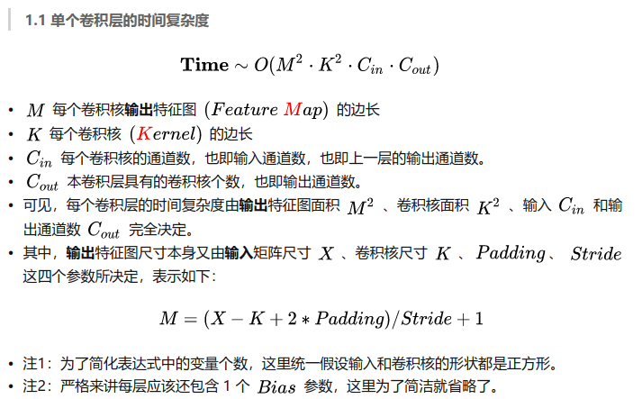
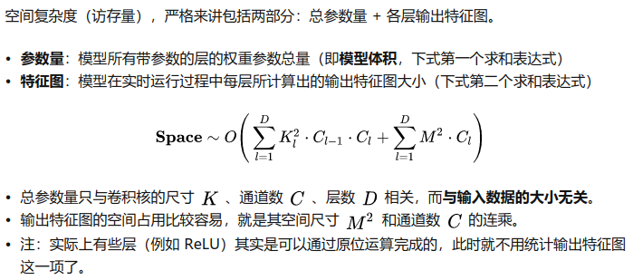

# 5-1

> 1. 证明公式5.6可以近似为离散信号序列$x(t)$关于t的二阶微分
> 2. 对于二维卷积，设计一种滤波器来近似实现对二维输入信号的二阶微分

1. 

$$
\begin{align}
x''(t) &= x'(t) - x'(t-1)\\
& = x(t+1)-x(t) - (x(t)-x(t-1)) \\
& = x(t+1) + x(t-1) -2x(t)
\end{align}
$$

2. 
   $$
   \frac{\partial^2f}{\partial x^2} = f(x+1,y)+f(x-1,y)-2f(x,y)\\
   \frac{\partial^2f}{\partial y^2} = f(x,y+1)+f(x,y-1)-2f(x,y)\\
   \text{二维信号的二阶微分为} \\
   \frac{\partial^2f}{\partial x^2}+\frac{\partial^2f}{\partial y^2}
   =f(x+1,y)+f(x-1,y)+f(x,y+1)+f(x,y-1)-4f(x,y)\\
   \text{可设计相应的滤波器如下}\\
   \begin{bmatrix}
     0& 1 & 0\\
     1& -4 & 1\\
     0& 1 &0
   \end{bmatrix}
   $$
   

# 5-3

> 分析卷积神经网络中用1×1的卷积核的作用

1. 降维&升维
2. 实现跨通道的交互和信息整合

# 5-4

> 对于一个输入为100×100×256的特征映射组，使用3×3的卷积核，输出为100×100×256的特征映射组的卷积层，求其时间和空间复杂度。如果引入一个1×1的卷积核，先得到100×100×64的特征映射，再进行3×3的卷积，得到100×100×256的特征映射组，求其时间和空间复杂度。

> 
>
> 
>
> 

因此

对第一种情况

- 时间复杂度

$$
\text{Time} \sim O(M^2 \cdot K^2 \cdot C_{in} \cdot C_{out})=100^2\times3^2\times256\times256 = 5898240000 \\
=5.8924\times10^9
$$

- 空间复杂度
  $$
  \text{Space} \sim O(\sum_{l=1}^D K_l^2\cdot C_{l-1}\cdot C_l+\sum_{l=1}^DM^2\cdot C_l) = 3^2\times 256\times256+100^2\times256 \\
  = 3149824 = 3.149824\times 10^6
  $$
  

对第二种情况

- 时间复杂度

  ​	
  $$
  \text{Time} \sim O(\sum_{l=1}^D M_l^2 \cdot K_l^2 \cdot C_{l-1} \cdot C_{l})=100^2\times 1^2\times256\times64+100^2\times3^2\times64\times256 \\
  = 1638400000 = 1.6384\times10^{9}
  $$

- 空间复杂度

$$
\text{Space} \sim O(\sum_{l=1}^D K_l^2\cdot C_{l-1}\cdot C_l+\sum_{l=1}^DM^2\cdot C_l) \\
= 1^2 \times 256 \times 64 + 100^2 \times 64 + 3^2 \times 64 \times 256 + 100^2 \times 256\\
= 3363840 = 3.36384 \times 10^6
$$

