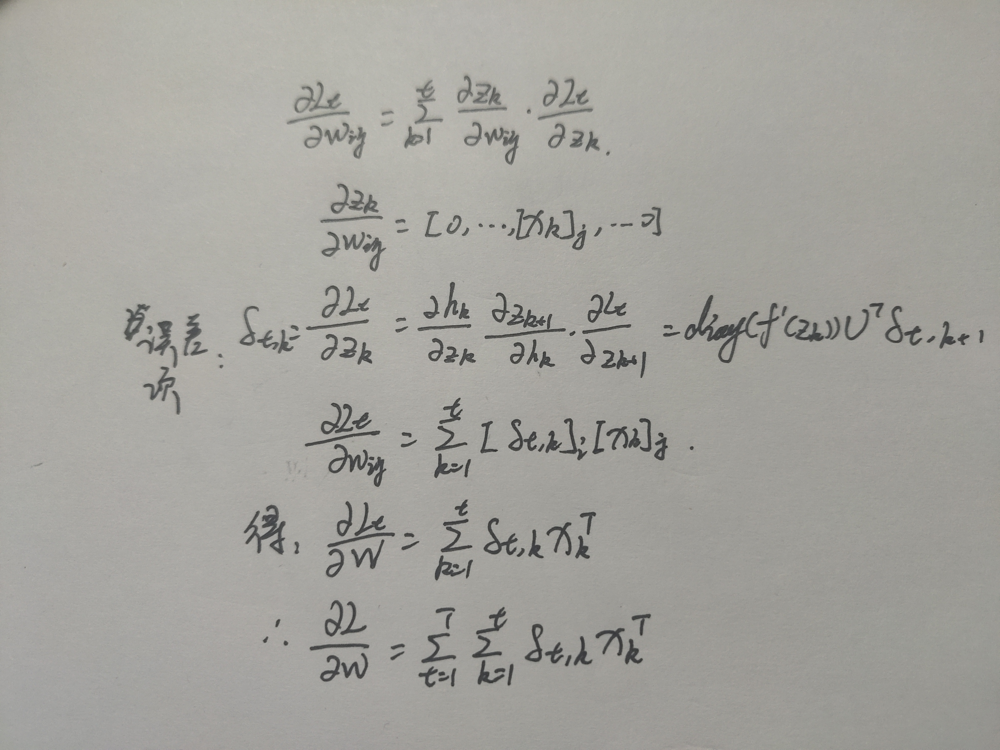
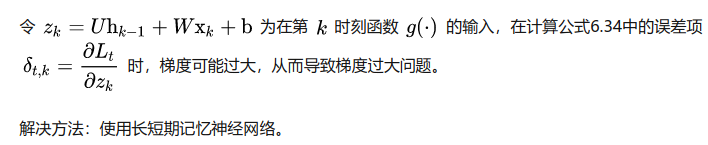

# 6-1

> 分析延时神经网络、卷积神经网络和循环神经网络的异同点

异：延时神经网络当前层神经元的活性值仅依赖于前一层神经元的最近K个时刻的活性值，而循环神经网络当前时刻的活性值依赖之前所有时刻的活性值。循环神经网络在时间维度上共享权重而卷积神经网络在空间上共享权重。

同：三种神经网络都共享权重。

# 6-2

> 推导公式6.40和6.41中的梯度

- 6.40 

- 6.41

$$
\frac{\partial L_t}{\partial b} = \sum_{k=1}^t \frac{\partial L_t}{\partial z_k} = \sum_{k=1}^t \delta_{t,k} \\
\frac{\partial L}{\partial b} = \sum_{t=1}^T \sum_{k=1}^t \delta_{t,k}
$$

# 6-3

> 当使用公式6.50作为循环神经网络的状态更新公式时，分析其可能存在梯度爆炸的原因并给出解决方法

引用自[课本]()